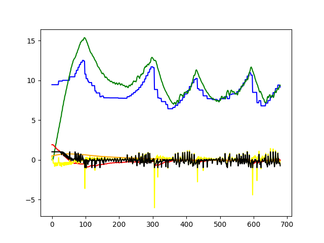
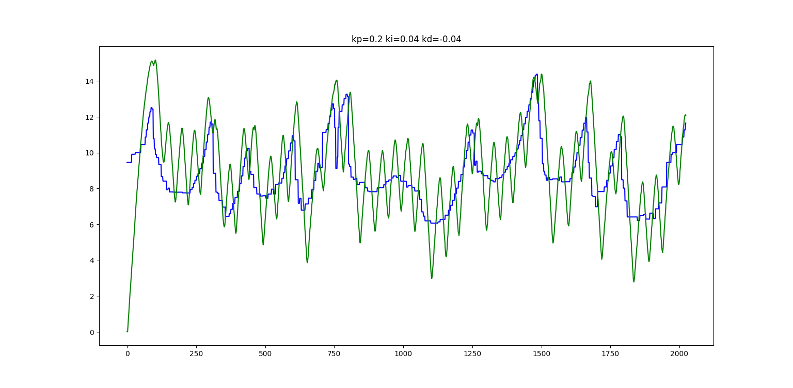
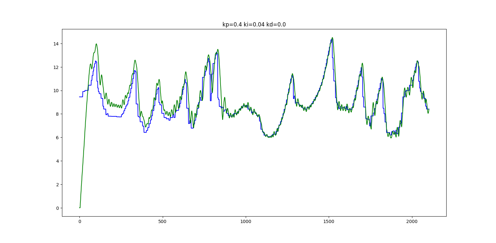
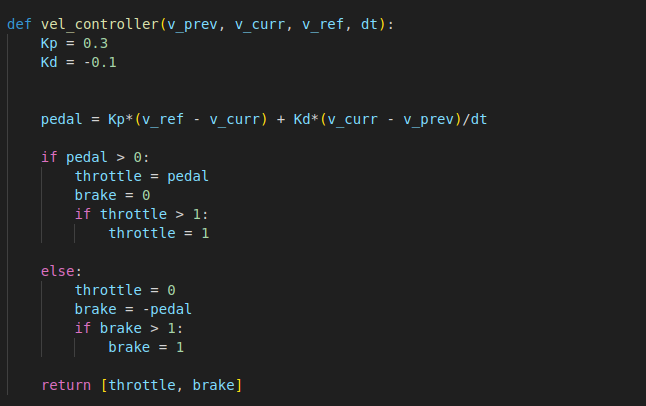

# Controls
This sections includes all the nitty-gritty of the algorithms involved in controls and the results obtained

## Acceleration / Braking 

We need to generate smooth a acceleration and braking actuation signals to follow the velocity profile generated.
We imploy a PID controller to do so.

### PID control

Our controller takes in the error as the signed difference between the current speed and desired speed. The desired speed is the speed at the closet waypoint given by velocity profile.

*
Put the control loop here
*

##### Problems Faced
Tuning our parameters for simulators like fsds is hard, let alone tuning the pararmeters for the actual which we do not even have.

*
Put the control loop here
*

More so on simulators, we don't face the inefficiencies of real life and hence tuning the Controller is even harder.

##### After resolving issues
Here are the best results from the simulators testing, where only only PPC is being tested

*
Wrong implementation of the PID controller
*

### Velocity Profile Generation
The optimal velocity at each point is calculated by taking into account the max frictional force available. The centripetal force and the lateral acceleration provided by friction. So intuitively due to higher centripetal force at turns compared to a stright at the same velocity, we have lesser friction for acceleration and deceleration. So after 

## Steering

### Pure Pursuit algorithm
A PID controller was used to control the accelerator and braking measurement.
This controller initially being tuned wasn't actually a PID control because it took the previous output of the control loop as a parameter rather than the previous error while trying to follow a velocity profile. And a differentiator on the output prevented the accelerator from clipping keeping the cra slow and hence even after a wrong implementation of the controller, the car stayed on track.

#### Steering control
Explain any shortcomings/issues with the algorithm and/or our implementation of it.

#### Challenges faced
Explain any challenges we faced while implementing the algorithm.

#### What could be done next?
- Delaunay triangulation for path planning in the first lap
- Stanley controller for steering

## Algorithms explored till now

#### Path Planning 
- Midpoint trajecotory
- Raceline trajectory

#### Controls
- PID control for braking/accelerating
- Pure pursuit algorithm for steering

written by Deep Boliya