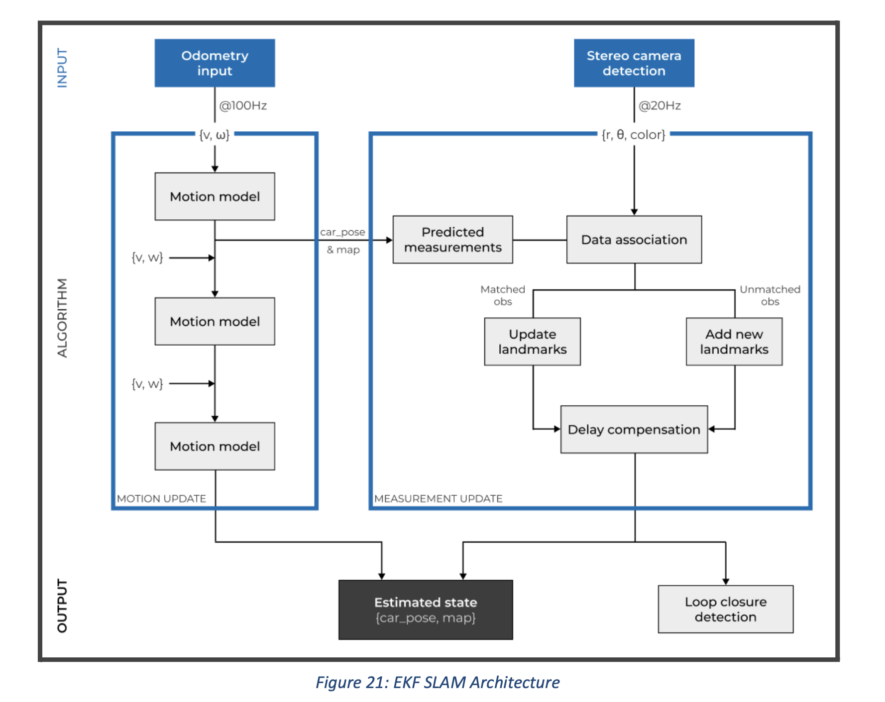
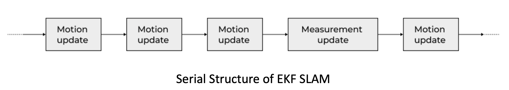
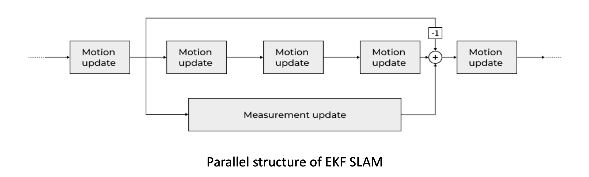

# EKF SLAM

Since the competition track would contain only cones, a feature/landmark based mapping is sufficient. Also, as the total number of features (or cones) will not be very high, EKF SLAM (being extensively researched) has shown that with a slightly modified architecture, it is real-time capable. Although not the most efficient algorithm (especially for complex scenarios), it has proved to be a good starting point for us.

The algorithm can be divided in 2 steps: 
1. Motion Update 
2. Measurement Update

### Motion Update
- We have used a simple motion model so that it updates the state frequently which is essential for real-time capabilities, with its output depending on the frequency of the odometry data (which is ~100 Hz).
- Due to inconsistency in input frequencies (because of reasons like synchronizing from multiple sensors and performance issues) a real-time sync Δt is implemented, calculated dynamically by the time taken to perform the motion update again. This results in slightly better estimations from the motion model.

### Measurement Update
- The measurement update step is computationally heavy as it checks for the matches between new measurements and the existing map which may lead to correction of the entire map and position of the car, i.e. complete state and covariance matrix have to be adjusted. The time taken largely depends on the square of the number of landmarks present on the map (or simply map size).
- The measurements of the observed cones for the measurement update, if taken from the camera, have a larger scope for error compared with lidar depths. Since the ICNN (Individually Compatible Nearest Neighbour) approach for data association is very sensitive to the increase in vehicle and sensor error, spurious pairings can easily be formed and will never be reconsidered. Hence, the JCBB (Joint Compatibility Branch and Bound) algorithm for data association was selected. Experiments have shown that JCBB is not only more robust than Nearest Neighbour, but also feasible in terms of computational cost.
- Because of the unavoidable errors in the sensors, some false positive landmarks can be recorded, which hamper the Path Planning algorithm and the data association step of the measurement update. This can be eliminated by keeping a threshold value for the number of times a landmark is observed. If the cone is under the threshold, it's removed from the map.

##### Serial Vs Parallel Structre
 - Initially, we tried to use the serial structure in which the motion update step is performed just after the measurement step is finished. This will not be real-time capable because the next motion update cannot begin until the measurement update is finished as measurement update takes a large time to finish. Also this presented a potential risk to the path planning algorithm, as an outdated car position could have serious consequences.

<!-- *
Fig:
* -->
- The answer to this problem is the parallelization of the motion and measurement update steps.

- The updated pose was adjusted for the difference in the initial pose to account for the prediction made since the measurement was received. This allows the algorithm to keep predicting the position estimated while performing the measurement step in the background. 
- This solves all of the problems mentioned above: the data is processed at different frequencies so there is always a short-term pose available for the subsequent module (Path Planning) to work with, and measurement update can take the required time until it is completed or until a new measurement from sensors is available.

### Loop Closure
- After one lap of the track, a static map is created and further observations will not increase the quality of the map significantly. This detection of the completion of a lap is called Loop Closure.
- This also increases the overall accuracy of all landmarks, as when the car is about to complete a loop, it re-observes some of the old landmarks(error in the location of these landmarks is very less).
- Incorrect loop closure results in catastrophic failure of SLAM and needs to be avoided to create a reliable system.
-  Loop closure is identified using three conditions: 
    1. It should detect orange cones (which mark starting and stopping positions).
    2. The estimated position of the car should be very similar to that of the initial position(±1m).
    3. The car's current heading has to be similar to the initial heading(±5°).
- After detecting loop closure, the car shifts from SLAM to Localization mode, where only the car's position is adjusted based on the cones detected.

#### What went well?
- We were able to run motion update and get pretty good results on everything FSDS simulator, Carmaker, Bot, and ADS-DV.
- Loop closure was detected accurately on the FSDS simulator.

#### What didnt went well?
- We werent able to run measurement update on the FSDS . It could be due to the erroneous reading(wrong depthmap) provided by the simulator or an error in data association part of the algorithm we wrote.
- As measurement update didnt work, there was no point in trying in the parallel structure of motion update and measurment. 

#### What we did?
- we chose to utilize available libraries and packages, which allowed for faster experimentation but provided less flexibility. Despite this limitation, these libraries served as a foundation for improving the precision and accuracy of our results.

#### What is the plan for future?
- Run measurement update on FSDS(using false perception reading), Carmaker and bot
- Make all the custom changes like other teams did(eg. keeping a threshold on number of times a landmark is seen before entering it in map)
- Implement parallel structure of motion and measurment update
- Implement Localisation part of the algorithm as well and check it on the simulators.
- On loop closure, implement conversion from SLAM to Localisation.

written by Shreyash Gupta