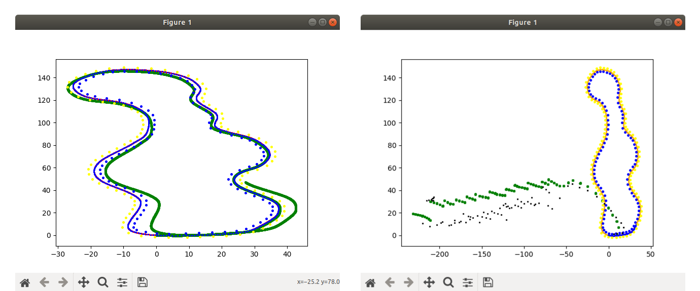
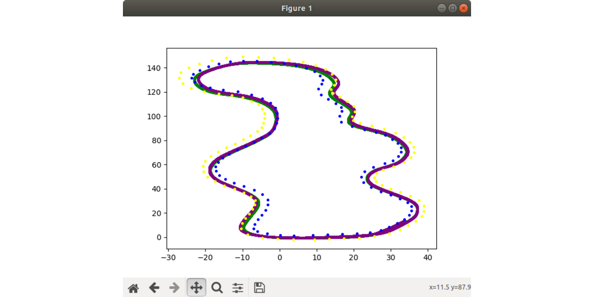

# Overview
Here we need to explain breifly (focus on future plans):

- what stage of the algorithm development we are in and what we are trying to achieve (no need to explain basics)
- what we have done till now and major issues encountered
- what we are planning to do next

## What we did in 2022-23

**TL;DR:** We initially planned to implement our own EKF SLAM algorithm in FSDS, but encountered problems with the data association step. Later found that the measurements coming in from the camera and lidar sensors were not correct. After spending several months trying to fix these problems, the team decided to implement SLAM libraries that are integrated with ROS - Cartographer & MRPT. Cartographer worked, but it produced a map that was not compatible with the PPC algorithm. MRPT worked better, but it only stored the positions of landmarks, not their colors. We fixed it using a "jugaad".

(*Add a contents sections here, and link to the sections below.*)

#### Initial Plan 

We started to continue with the previous year's work, implementing the EKF SLAM algorithm. We were having some trouble implementing the measurement update (specifically, the data association part). This year the team made a decision to start working with the FSDS simulutor since it provides a realistic environment and not just some dummy sensors (were using FSSIM before).

 
*
Fig: EKF SLAM (Motion update only) on FSSIM, before we started
*

After setting up the simulator, we were able to run motion update with some effort, at the start of August. For trying to solve the data associtation problem, we saw many teams use an algorithm called JCBB (Joint Compatibility Branch and Bound) which is supposed to be more robust and faster than the Nearest Neighbour approach ([check this paper](https://web.mit.edu/2.166/www/handouts/Neira_TRA_2001.pdf)). We referred to these [codes](https://github.com/ayrmoney/SLAM-by-J.-Neira) for the implementation of JCBB. Since, different sources had different assumptions regarding the EKF algorithm, which meant different matrices with different sizes, it created a lot of confusion on which one to choose. We looked into the algorithm proofs, which helped in deciding that to some extent. But we still were getting very weird results, and were certainly not close to fixing the issue.

*
Fig: Motion update (left) and Measurement update (right) on FSDS
*

For detecting loop closure, we researched what other teams have implemented (**list sources**), and came out with the criterias that would have to match for a loop closure to be detected and hence switching from SLAM to Locaclization.

This **[repository](https://github.com/dv-software-22-23/slam/tree/FSDS_EKF_PPC_Fusion)** contains the most updated code for the EKF SLAM algorithm implemented. Check [EKF SLAM](ekf_slam.md) for more details.

#### What wasn't going well

After a lot of trying, we found out that the measurements coming in with Camera and Lidar, with ROS bridge are not correct (they seem fine with the python client). Running camera also causes the simulator to have performence issues, [see issue on github](https://github.com/FS-Driverless/Formula-Student-Driverless-Simulator/issues/292). 

By this time, we had already spent a lot of time on fixing measurement update issue (~3-4 months), and weren't confident enough to fix that before this season, which caused us to take a pause think about a different approach to implement SLAM. We explored a lot of libraries that provide SLAM implementations and found many are integrated with ROS itself (check out **[libraries for SLAM](https://www.notion.so/ayrmoney/074538d9292a4b3daaf3b22b06ab1cec?v=60693a31d0b9473c93a860b24671c1cd&pvs=4)** for details on slam libraries we explored).

| Library name      | Status | Remarks |
| ----------- | ----------- | -------- |
| rgbdslam_v2      | Didn't start       | ros-kinetic, c++, boht realistic map |
| orb_slam3   | Halted        | tutorial of running it in FSDS, nvidia-docker requires nvidia gpu |
| ov2_slam   | Didn't start        | stereo visual slam, ros melodic |
| mrpt   | Works!        | many types of algorithms, has range-bearing EKF |
| cartographer   | Works!        | LaserScan, occupancy grid |
| gmapping   | Didn't start        | LaserScan, occupancy grid |
| rtabmap   | Didn't start        | bunch of inputs/subscribers, RGBD |
| gtsam   | Didn't start        | landmark based example given, ros integration? |
| servo   | Didn't start        | used by AMZ team |

#### How we tried to resolve it

We went ahead to first implement **Cartographer** ROS library as it had good documentation and was comparatively fairly recent too. With some effort, we were able to get it working with FSDS. We ran it with the bag recorded with PPC running controlling the car to follow middle line (following the tutorial [here](https://google-cartographer-ros.readthedocs.io/en/latest/your_bag.html)). It worked but the results were not impressive, it was still mostly dependent on the odometry data we were providing, (motion update) and only did slight improvements to it. We also couldn't test it along with PPC, as Cartographer provides a occupancy grid type map, which is not what PPC expected (simple list/dict of cone position and color).

*
Fig: Cartographer result, very little improvements
*

There was only one ROS-integrated SLAM library, we found that could produce a simple map that PPC already worked with - **MRPT**. Implementing it was similar to Cartographer, so that helped. Since, still the issue of 'bad measurements' existed in the FSDS simulator, we had to work with fake measurements (returns the ground truth positions/color of cones relative to the car). With that its results were decent and we were able to get it running with PPC as well. One thing we missed - MRPT (ekf_slam_2d) only uses/stores the positions of landmarks (i.e. cones) and not their color, which again is a issue because PPC needs it to calculate the path to be followed. This was fixed as a 'jugaad' by using... **(explain how we fixed it).**

#### Results
Explain how did we measure the results, and what were the results we got. Do share pirctures of them.

#### The good
Explain the good things/postive things about the algorithm and/or out implementation of it.

#### The bad
Explain any shortcomings/issues with the algorithm and/or our implementation of it.

#### Challenges faced
Explain any challenges we faced while implementing the algorithm.

#### What could be done next?
Explain what we could do next to improve the results, and how we may move further.

## Algorithms explored till now
List the algorithms/libraries we have explored till now, and give a breif description of each's implementation, the postives/negatives.

- EKF SLAM
- FastSLAM
- MRPT
- Cartographer