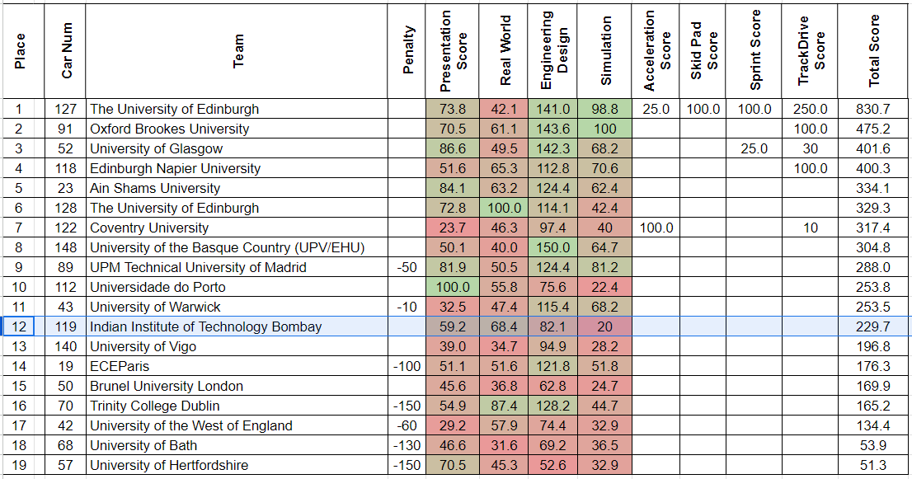

# Goal 2024

### Last season

**Highlights:** We became the first team from India to participate in FSAI last season. We overall stood 12th among 19 teams. All our points came from static events. We were 3rd in Real world AI event.


*<center>FSAI'23 Overall results</center>*

#### Dynamics

We were not expecting dynamic results, and had the main goal to successfully set-up communication with their ADS-DV car and clear inspections. We were able to achieve this, but there's one rule which we missed regarding inspection,

```
The vehicle must sweep the steering left and right and return to straight.
```

We planned to take a hunch at acceleration event, but couldn't participate as we couldn't get slot due to bad weather/rain.

#### Statics

We did very bad in the Simulation dev event - we failed to explain how, what we simulated with different simulators would translate to real life. 

Also we didn't prepare the presentaions well in ED & Sim dev, which led delay in the presentation time!

!!! note
    More static feedback needs to be taken from Gopalan...

### This season

FSAI final goal + strategy to achieve this + perfect opportunity to perform!

This season too, we'll be going to participate in the same compitition - FSAI'24. Having sorted out communication with the car from last season + we being close to running full end-to-end pipeline + have every sensor/hardware we'll need, gives us a very good opportunity to aim big, bring back results!

**We're aiming to finish under overall top 3.** For this we'll need atleast ~200 more points compared to last year, not an easy task! 

We'll earn these by improving on our mistakes in Engineering Design statics + Sim Dev. And for dynmaics, we'll put more priority on completing Accel & Skidpad events than Autocross / Trackdrive. This makes sure we're loosing easier points due to last minute workarounds to make accel/skidpad work!