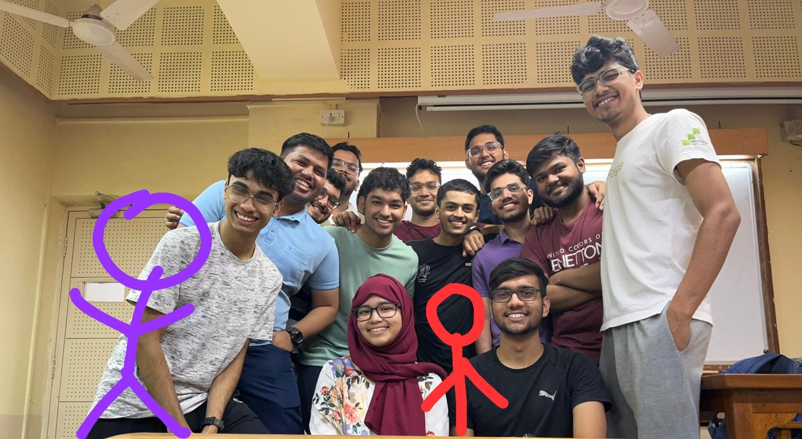

# IIT Bombay Racing Team Wiki

### What this wiki contains

This wiki stores & conveys the knowledge the driverless team has gained over the past few years. This contains the current progress of each subsystem, and also tries to discuss the journey of how we reached at this stage, which would be valuable for anyone in the team curious of why some of the decisions were made and help them make a faster decision over if they still make sense or not.

We also have included 'Weekly priorities' page, which will be updated weekly with the team's task (with assigned person) & major priorities. This can be helpful for the alumuni's to get detailed info about what the team is working on + help us be focused on smaller goals to complete the larger goal.

This wiki doesn't contain basic theoritical knowledge about any topic! (but we can combine them at one place though...🤔)

!!! note
    This is our first version, and still not in a very finished state -- we appreciate any feedback on this (what more info can we include / should we change any structure /..)

#### Project layout

    mkdocs.yml    # The configuration file
    docs/
        index.md    # This wiki homepage
        goal.md     # Goal for this year
        howto.md    # Step wise guides for common tasks (in progress)
        updates.md  # Weekly tasks
        perception/
            overview.md  # State of perception algos
        estimation/
            overview.md  # State of slam algos
            ekf.md       # Details for our ekf algo
            mrpt.md      # Details for MRPT library used
        controls/
            overview.md  # State of ppc algos
            planning.md  # Logic for the path planning algo
            controls.md  # Results & logic of controls algo
        sysint/
            overview.md  # Work done + to be done
            can.md       # Explains CAN + work done with ADS-DV 

### Why this wiki?

- build to convey context around our existing state + how did we arrive at this state
- easier to navigate through a subsystem topic & get the info fast!
- hoping, down the line this leads to better/faster decision making

*
Team, major missing: Madhav, Arnav, Rohan, Shubham, Vishwam, Ayush (def need a new photo)
*