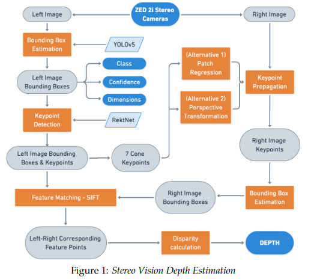

# Overview
Here we need to explain breifly (focus on future plans):

Takes in data from LiDAR and ZED2i stereo cams (have to choose between taking from 2 stereocams or 1 stereocam), find class, depth and bearing of cone and send this to SLAM

Pipelines for depth estimation:

- Stereo (Running)
- Mono using PnP (Running, not very good)
- Mono using BB height + stereo for edge cases (Running)
- Lidar only (To be developed)
- Lidar Mono fusion (Running, although very bad)

Accuracy: Mono BB height > Stereo > Mono PnP >>>> Lidar fusion
Latency: Mono BB height < Mono PnP < Stereo (Lidar unkown)

Major issues:

- SIFT latency
- Yellow BB detected twice and classified as unkown as well
- CarMaker map not customizable
- FSDS inherent depth map wrong (our conclusion)

Plans:

- Fusion pipepline running with high accuracy
- Start up scripts running for all sensors and perception
- Modular code with one param for environment (simulator / bot / actual car map) and one param for sensor stack
- SIFT on GPU

## What we did in 2022-23
Everything is over here: https://drive.google.com/drive/folders/1uytmMQZ6OIU8GvSoflgg-gTA-Q-w-dff?usp=drive_link

<!-- **TL;DR:**

(*Add a contents sections here, and link to the sections below.*) -->

#### Initial Plan 

Explore all different pipelines and see their latencies and accuracies
For FS23:
- Run mono on BB on all simulators and real life (it worked everywhere except FSDS)

#### What wasn't going well
SIFT latency was too high and in general also, stereo accuracy isnt very good
Major chunk of problems were also realised in sensor integration and trying to run the sensors and take images from ROS
Perception wasnt running on all simulators (FSDS initially had)

#### How we tried to resolve it

Come up with new and improved pipelines
for eg:

- Slender BB in SIFT for removing outliers on the road
- Mono using BB
- Top 1 keypoint in sift to improve accuracy

#### Results
[TEST ANALYSIS](https://docs.google.com/document/d/1DjbddiCy1eq-4h39NRJdKfY5A1mYQLK_NXnZZhUIR6s/edit?usp=drive_link)

[RESULTS DATABASE](https://docs.google.com/spreadsheets/d/1rsW-HaELM-i9SkwVesPqJ5heiMxQTBVtV0hdAOH5Cd4/edit?usp=drive_link)

#### The good
Comes out in the test analysis and results

#### The bad
Latency and accuracy

#### Challenges faced
1. Finding out what code to write and how
2. Necessary dependencies and their usage
3. Analysis of results using SLAM and on simulators

#### What could be done next?
1. Fusion
2. New research on deep learning based depth estimation
3. SIFT on GPU

## Algorithms explored till now
All the different pipelines and each of their working
