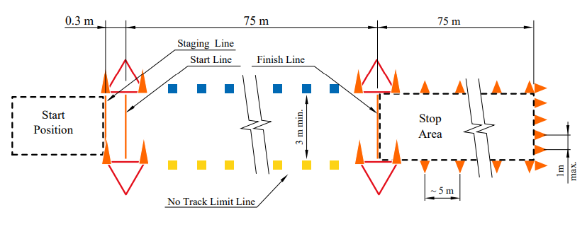
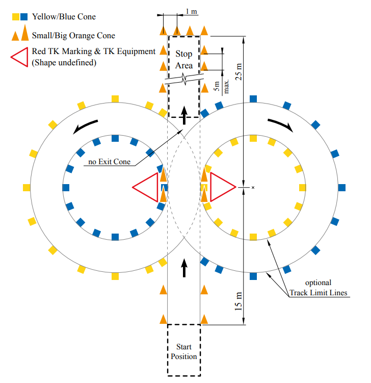

# Weekly priorities

### Oct 2 - Oct 9

- **Sim dev setup in Carmaker** @Mohak Vyas
    - github repo setup — [P0 !!] **(blocking!)**
        - should be able to launch carmaker easily
        - change topic names to common topic names chosen
        - launch file for acceleration
    - acceleration map ready — [P0] **(blocking!)**
    - able to get ground truth info (cones/car location, speed, …) — [P1]

- **Acceleration in carmaker** @Deep Boliya @Mohak Vyas
    
    goal: to complete under 5 sec in simulations
    
    
    
    FSAI: 0.3m from starting line, 75m track length, 3m wide, 100m stopping length
    
    - port → carmaker — [P0]
    - improving accel based on to-dos — [P0]
        - [x]  tuning the pid
        - [x]  improving controller → differential one
        - [ ]  clamp steering (not do too much steering at any time) (ya to extreme case nahi aayega ya recover nahi hoga)
        - [x]  start mein teda krke chala ke dekho…
    - start impelementing ‘alternate ways’ — [P1]

- **Skidpad ideation**
    
    goal: to complete under 20 sec in simulations
    
    
    
    FSAI: The foremost part of the vehicle is staged 15m before the timekeeping line. Pehle right - second lap on right turn is timed. Then left turn - fourth lap on left is timed. must come to a full stop within 25m after crossing the timekeeping line
    
    - come up with ways we can complete skidpad — [P0] @Ayush Rohilla @DEs

- **Perception specific**
    - able to run from a launch file (fix path error) @Yash Rampuria — [P0] **(blocking!)**
    - researching on how to: @Yash Rampuria — [P1]
        - improve latency in mono pipelines?
        - improve range in stereo/mono pipeline?
    - using nueral network: @tangri — [P0]
    - lidar pipeline: @nakul — [P1]
        1. Find u v of a cone centre approximately and using step 3 ka result, find corresponding depth: ~2-3 days
    - yolo retraining: @abhimanyu — [P1]
    - sift on gpu @rajit - driver error — [P0] **(blocking!)**
    

- **Slam specific**
    - root cause for data association issue (in fsds, with fake meas) — [P0] @Shreyash Gupta **(blocking!)**
        - update/correct full code according to a single ref
        - do a 2very structured root cause analysis
    - graphslam @Shreyash Gupta @rohan — [P1]
        - figure out g2o & graphslam implementation (g2o, …?)
        - start writting some code for… (what should we aim for initially?)
    - porting fastslam → carmaker @Shreyash Gupta @arnav— [P1]
    - better velocity estimation / odometry estimation method @amna — [P1]

- **PPC specific**
    - get & understand psuedo-transient model from @chandu @Deep Boliya
    - plan on delaunay triangulation
    - Complete stanley implementation @ajinkya @ayush
    - Get fsds working with ros bridge and implement Pure pursuit @shubham **(blocking!)**
    - get fsds working, core dumped @ayush **(blocking!)**
    
    !!! note
        📌 JDEs trying to implement ppc without looking into code, interpolating + stanley controller + vel profile / pure-pursuit ~ 3-4 more days. They’re coming with some new ideas to implement.
    

- **Sys-int specific**
    - able to run iitbdv repo, with docker, on fsds rosbag (mono, mrpt, middle/raceline + accel) @bhaskar
    - explore CAN in carmaker @MG
    - figuring out gui in docker @vishwam
    
    !!! note
        ❓ carmaker: cone ke white stripes nahi hone chahiye, road ke white stripes se interfere (have cone models with black stripes) @Mohak Vyas. Will we be able to do this?
    

- **Jetson** — [P0]
    1. not booting up, try reinstalling / force recovery mode ubuntu @Mohak Vyas @vishwam **(blocking!)**

- **Team wiki completion** — [P1]
    - **Perception:** incorporate the feedbacks, more pages? @Yash Rampuria
    - **SLAM:** complete MRPT page @Shreyash Gupta
    - **Sys int:** incorporate the feedbacks, more pages (simulatation, bot) @Mohak Vyas @MG

- **Ideation on Trainee modules** - [P2]
    
    Recruitment might start late. Need a different/structured recruitment + trainee module plan so that:
    
    - reach more freshers, when we’re starting recruitment late?
    - min effort by team (a lot of time/effort goes for debugging errors / installing in the modules)
        - structured week-by-week content with assignments documented on docs / github
        - meeting with trainees one time a week?
    - a good efficient outcome (we gave 4 months, but they still some have installation issues + need to more training to be able to contribute to their subsystem).
        - should we spend less time in modules, and make JDEs faster so they’ve more time to learn their subsytems?
    - how to improve SLAM module? - no first pref till now ☹️

### Sept 26 - Oct 1 [12/27 = 44%]

- **Sim dev setup in Carmaker** @Mohak Vyas ❌
    - github repo setup — [P0 !!]
        - should be able to launch carmaker easily
        - change topic names to common topic names chosen
        - launch file for acceleration
    - able to get ground truth info (cones/car location, speed, …) — [P0]
    - acceleration map ready — [P0]

- **Acceleration in carmaker** @Deep Boliya
    
    0.3m from starting line, 75m track length, 3m wide, 100m stopping length
    
    - list alternative ways to complete acceleration — [P0] ✅
        1. seeing first few cones & interpolating to get boundary paths
            1. to stay within boundary, we’ll need to know our location → use odometry
            2. initial cones might not be accurate enough → lines might not be very straight
                - [ ]  plot in rviz to test this
        2. using Lidar
        3. only orientation
            1. based on assumption that car is staged centered + we can get accurate yaw for a while from imu

    - bearing method (fix the stopping position, Thu night) → carmaker — [P0] ✅
        - what are possible wrong outcomes, with this implementation?
        - on ads-dv will need to aim for an ideal speed to follow, such that pts max + are able to stop safely within 100m (depends on the stopping potential)
        
        !!! note
            🚀 FSDS mein:
            
            - speed 4ms se zyaada nhi
            - off track jaate hi gone case
            - can we use orientation of car to further improve this??
            - using total distance travelled as stopping logic… assuming distance from encoder data to be pretty acurate (as per deep’s experience with ADS-DV), if ads-dv isn’t giving accurate distance tune it there to go more than 75m or less than 75m as req…
            

            **further to dos:**

            - start mein teda krke chala ke dekho…
            - AS_FINISH logic, and successfully return ‘AS_FINSIH’ on terminal - can be done when we port → Carmaker
            - tuning the pid
            - improving controller → differential one
            - clamp steering (not do too much steering at any time) (ya to extreme case nahi aayega ya recover nahi hoga)
            - weighted sum with orientation (not much weight)
            - if off track: yellow/blue identify karke make a turn (if speed is enough, we might not have enough time to see all yellow & deicide to make a turn)
        
    - start impelementing ‘alternate ways’ — [P1] ❌

- **Perception specific**
    - able to run from a launch file (fix path error) @Yash Rampuria — [P0] ❌
    - researching on how to: @Yash Rampuria — [P1] ❌
        - improve latency in mono pipelines?
        - improve range in stereo/mono pipeline?
    - lidar pipeline: @nakul @abhimanyu — [P1]
        1. Put the transformation matrix in a variable as a multiplication of 3 4 different transformations (exteinsic intrinsic etc) ✅
        2. Learn how to read pcd data ✅
        3. Pcd has data in the format (x y z I) and u need to convert it to (u v depth) ✅
        4. Find u v of a cone centre approximately and using step 3 ka result, find corresponding depth - ~ 2-3 days ❌
    - sift on gpu @rajit - driver error ❌
    
    !!! note
        ❓ Mono giving different sizes of bounding box for one side → some bias in depth → perception + slam: deviating from straight. @Yash Rampuria what are we doing about this??
    

- **Slam specific**
    - root cause for data association issue (in fsds, with fake meas) — [P0] @Shreyash Gupta ❌
    - graphslam: come up with a plan @Shreyash Gupta @rohan — [P1]
        - collect resources ✅
        - get overview of the algo ✅
        - examples on how it can be implemented (g2o, …?) ❌
    - porting fastslam → carmaker @Shreyash Gupta @arnav— [P1] ❌
    - better velocity estimation method @amna — [P1] ❌
    - ~~porting mrpt → carmaker??? (ho rakha hai)~~

- **PPC specific**
    - @Deep Boliya to add jde tasks for this week ❌
    
    !!! note
        📌 JDEs trying to implement ppc without looking into code, interpolating + stanley controller + vel profile / pure-pursuit ~ 3-4 more days. Through this they’re coming with some new ideas to implement.
    

- **Sys-int specific**
    - ros2 karna hai ki nahi? (~1-2 din mein decide) — [P1] @Mohak Vyas ✅
        
        nahi for now: faaltu bt nhi lena hai / ros2 has a better way to send msgs than ros1 (less delays due to truely parallel architecture) / ros1 noetic eol in 2025, have two years atleast / we’re all familiar with ros1, will take some to get used to ros2 as well
        
    - docker: plan for integrating (~1-2 din) — [P0] @MG @jdes ✅
        - what should the final output be like?
            
            (what all will it ‘contain’? system requirements, probably require nvidia graphic cards?)
            
        - things the docker should contain 
        https://docs.google.com/document/d/1ojJ-bONWIKGVy3xhxL1UiQXZqVMYcOj-czewkg0QXAo/edit
    
    !!! note
        ❓ carmaker: cone ke white stripes nahi hone chahiye, road ke white stripes se interfere (have cone models with black stripes) @Mohak Vyas. Will we be able to do this?
    

- **Jetson** — [P0]
    1. not booting up, try reinstalling / force recovery mode ubuntu @Mohak Vyas ❌
    2. reach out to nvidia/help center/… @Ayush Rohilla ✅
        1. reaching out through forums - suggesting same, that we should reflash our board with sdkmanager from another x86 host
            
            https://forums.developer.nvidia.com/t/jetson-agx-orin-not-booting-up/267798
            
        2. trying force recovery mode - 
            
            https://forums.developer.nvidia.com/t/agx-orin-not-booting/258038
            

- **Team wiki completion** — [P1]
    - **Perception:** incorporate the feedbacks, more pages? @Yash Rampuria ❌
    - **SLAM:** complete MRPT page @Shreyash Gupta ❌
    - **Sys int:** incorporate the feedbacks, more pages (simulatation, bot) @Mohak Vyas @MG ❌
    - **Overview:** home, goal & vision 2024, ~~compi 101~~, ~~culture?~~ @Ayush Rohilla ✅
    - Local to web, using github hosting, (any method to keep it private!??) @Ayush Rohilla ✅
        - github host from org - not possible, with a personal account, public repo - host possible
            
            need to search for alternate tools for free private github pages -- static.app/sites fast enough (https://lime-otter.static.domains/)
            

- **Doubts**
    - whats stopping us to use Windows instead of linux (LOL had existential crisis for a min)? — jetson mein linux hota hai

### Sept 13 - Sept 25

Midsem break

### Sept 4 - Sept 12 [10/20 = 50%]

- Metric targets for perception/slam/ppc to reach for a successfull integration @DEs @Ayush Rohilla — [P0]
    - **Perception:** accuracy, range, outlier%, latency ✅
        
        currently we’re at - range<10m (less than two pairs of cones visible), latency bad for stereo with sift, avg error ~3.38% for mono
        
        Range: <10m → 15+m
        
        Latency: 2-3sec / 100ms → 50ms (20hz)
        
        Avg error: ??
        
    - **SLAM:** mean squared error, cone count, matching ratio, error threshold, latency of output to ppc ❌
        
        currently we’re at - min range that works is~20m with custom_meas of super accuracy, at about ~2m/s max velocity — nahi to it’s not able to complete the whole lap
        
        were getting mean squared error of ~0.01 m^2, correct cone count for a lap (didn’t calculate matching ratio / error threshold yet), latency ~100hz with update from meas ~20hz 
        
        - (noisy fake_meas ke saath try….)
        - why multiple freq in IMU?
        - extra cones being identified
        - discuss with @Shreyash Gupta
        
    - **PPC:** time taken in each type of event (also our north star metric), cones hit, max vel/accln
        
        raceline: 32sec, firstlap: ? (range se input leke) ✅
        
        cones hit: 0, max vel: ?, max accel: ?
        
        accln: ~6-7 sec, skidpad: ~30sec, trackdrive: ~1min (+-20sec), fastlap: fsai mein to slow slow hi (check fsg timings)
        
        **can PPC take & use gridmap???**
        
        (mainly frequency pe hi depend karega output, given error itna hai ki it can complete event)
        
        **Tentative targets in simulations**
        
        Accln: 5sec
        
        Skidpad: 20sec
        
        Autocross: 45sec
        
        Trackdrive: 35sec
        

- SLAM - which algorithms to prioritize on? (tough question!) @Shreyash Gupta @Ayush Rohilla — [P0] ✅
    1. **EKF meas mein use fake meas FSDS… (can debug) — root cause???**
    2. fastSLAM — port to FSDS (from fssim)
    3. graphslam — what is g2o / how to implement?
    4. mrpt — localization with range bearing (if possible)

- Which simulator to continue on?
    - Carmaker (global cones position/route coordinates? & IMU sensor add?) @Mohak Vyas — [P0] ✅
    - FSDS (depthmap isn’t correct!) @Mohak Vyas @Yash Rampuria — [P1] ❌
    - FSSIM (why did we discontinue this + current state?) @Ayush Rohilla — [P1] ❌
    - Steps to create our own simulator @Mohak Vyas — [P2] ❌

- Different strategies to complete Accln
    - **Other ways to do accln?? — [P0]** ❌
    - Perc + PPC (with no slam) finish implementing @Yash Rampuria @Deep Boliya — [P1] ✅

- Jetson status… @Deep Boliya @Mohak Vyas @Ayush Rohilla — [P0] ✅
    
    send to Nvidia if broken / we can’t fix it :(
    not booting up, try reinstalling os +have  reach out to nvidia
    

- JDE KTs (knowledge transfer) @DEs @JDEs — [P0] ✅
    
    we want all JDEs to be able to contribute to the team asap!!
    
    have started giving them real tasks as well…
    

- Team wiki completion — [P1]
    - **Perception:** incorporate the feedbacks, more pages? @Yash Rampuria ❌
    - **SLAM:** complete MRPT page @Shreyash Gupta ❌
    - **PPC:** incorporate the feedbacks, add vehicle dynamics/controls/ads-dv page @Deep Boliya ✅
    - **Sys int:** incorporate the feedbacks, more pages (simulatation, bot) @Mohak Vyas @MG ❌
    - **Overview:** home, goal & vision 2024, compi 101, culture? @Ayush Rohilla ❌
    - Local to web, using github hosting @Ayush Rohilla ❌

- Sys architecture + repo structure @DEs @Ayush Rohilla — [P1] ✅

- Rulebook prep for quiz on Sat @DEs @JDEs — [P1] ✅